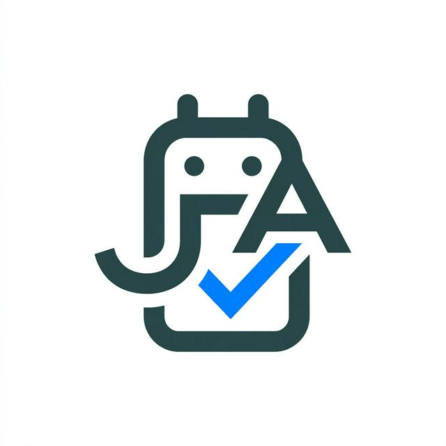

# 👔 Universal Job Applier AI 🤖

<div align="center">
  
  <p>
    <strong>L'assistant de candidature ultime : Automatisation & Personnalisation IA pour WTTJ, Hellowork, Glassdoor et VIE.</strong>
  </p>

  <p>
    
    
    
    
  </p>
</div>

---

## 🌟 Pourquoi choisir Universal Job Applier AI ?

Postuler à des dizaines d'offres manuellement est une perte de temps. **Universal Job Applier AI** ne se contente pas d'envoyer votre CV : il le **rédige** et l'**adapte** pour chaque mission grâce à l'IA (Mistral/OpenAI). 

Il simule un comportement humain complexe pour naviguer sur les sites d'emploi les plus populaires :
- 🌴 **Welcome to the Jungle** : Scrapping et postulation 100% automatique.
- 💼 **Hellowork** : Détection des champs, upload de CV et gestion des questionnaires.
- 🏢 **Glassdoor** : Support des candidatures "Easy Apply".
- 🌍 **Mon VIE (Business France)** : Idéal pour les jeunes diplômés cherchant un contrat international.

---

## 🔥 Fonctionnalités Exclusives (v2.2.1)

- 🖥️ **Dashboard Web Intelligent :** Pilotez tout votre recrutement depuis une interface élégante (v2.2.1).
  - **Bridge Interactif :** Validez vos actions manuelles en un clic via le bouton **"VALIDER ACTION"**.
  - **Logs en Temps Réel :** Suivez chaque clic et chaque décision de l'IA.
- 📄 **Cerveau de Personnalisation :**
  - **Mode PPTX Dynamique :** Vos puces d'expérience sont réécrites pour matcher les mots-clés de l'offre (ATS proof).
  - **Mode HTML/Canvas :** Un CV minimaliste et ultra-premium généré à la volée.
- 🧠 **Dual-Engine IA :** Utilisez Mistral pour l'analyse brute et OpenAI pour la rédaction fine (ou vice-versa).
- 🛠️ **Zéro Crash Windows :** Entièrement purgé de tout bug d'encodage (100% ASCII-compatible).

---

## 🚀 Installation Rapide

1. **Clone it :**
   ```bash
   git clone https://github.com/votre-compte/universal-job-applier-ai.git
   cd universal-job-applier-ai
   ```

2. **Install it :**
   ```bash
   pip install -r requirements.txt
   playwright install chromium
   ```

---

## ⚙️ Configuration Intuitive

Copiez le fichier `.env.example` vers `.env` et laissez-vous guider par les commentaires.
Toutes vos données (Expériences, Lettre type, CV) sont isolées dans le dossier `user_data/` pour une sécurité maximale.

---

## 📈 Guide d'Utilisation

1. **Lancement du Dashboard :**
   ```bash
   python app.py
   ```
2. **Accès :** `http://localhost:5000`
3. **Action :** Collez une URL de recherche (ex: liste de jobs PMO à Paris sur Hellowork), choisissez votre mode et lancez la machine !

---

## 🤝 Contribution & Disclaimer
Les contributions sont les bienvenues ! Cet outil est destiné à vous aider, mais utilisez-le de manière responsable vis-à-vis des plateformes.

<div align="center">
  <i>Propulsé par l'IA pour révolutionner votre recherche d'emploi. 🚀</i>
</div>
